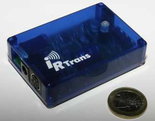

# ioBroker.irtrans_up

[](https://www.npmjs.com/package/iobroker.irtrans_up)
[](https://www.npmjs.com/package/iobroker.irtrans_up)
[](https://david-dm.org/upeter2/iobroker.irtrans_up)
[](https://snyk.io/test/github/upeter2/ioBroker.irtrans_up)

[](https://nodei.co/npm/iobroker.irtrans_up/)

**Tests:**: [](https://travis-ci.org/upeter2/ioBroker.irtrans_up)

## irtrans_up adapter for ioBroker

Describe your project here

## Developer manual
This section is intended for the developer. It can be deleted later

### Getting started

You are almost done, only a few steps left:
1. Create a new repository on GitHub with the name `ioBroker.irtrans_up`

1. Push all files to the GitHub repo. The creator has already set up the local repository for you:  
	```bash
	git push origin master
	```
1. Head over to [main.js](main.js) and start programming!

### Scripts in `package.json`
Several npm scripts are predefined for your convenience. You can run them using `npm run <scriptname>`
| Script name | Description                                              |
|-------------|----------------------------------------------------------|
| `test:js`   | Executes the tests you defined in `*.test.js` files.     |
| `test:package`    | Ensures your `package.json` and `io-package.json` are valid. |
| `test` | Performs a minimal test run on package files and your tests. |
| `coverage` | Generates code coverage using your test files. |

### Writing tests
When done right, testing code is invaluable, because it gives you the 
confidence to change your code while knowing exactly if and when 
something breaks. A good read on the topic of test-driven development 
is https://hackernoon.com/introduction-to-test-driven-development-tdd-61a13bc92d92. 
Although writing tests before the code might seem strange at first, but it has very 
clear upsides.

The template provides you with basic tests for the adapter startup and package files.
It is recommended that you add your own tests into the mix.

### Publishing the adapter
See the documentation of [ioBroker.repositories](https://github.com/ioBroker/ioBroker.repositories#requirements-for-adapter-to-get-added-to-the-latest-repository).

### Test the adapter manually on a local ioBroker installation
In order to install the adapter locally without publishing, the following steps are recommended:
1. Create a tarball from your dev directory:  
	```bash
	npm pack
	```
1. Upload the resulting file to your ioBroker host
1. Install it locally (The paths are different on Windows):
	```bash
	cd /opt/iobroker
	npm i /path/to/tarball.tgz
	```

For later updates, the above procedure is not necessary. Just do the following:
1. Overwrite the changed files in the adapter directory (`/opt/iobroker/node_modules/iobroker.irtrans_up`)
1. Execute `iobroker upload irtrans_up` on the ioBroker host

## Changelog

### 0.0.1
* (upeter2) initial release

## License
This is free and unencumbered software released into the public domain.

Anyone is free to copy, modify, publish, use, compile, sell, or
distribute this software, either in source code form or as a compiled
binary, for any purpose, commercial or non-commercial, and by any
means.

In jurisdictions that recognize copyright laws, the author or authors
of this software dedicate any and all copyright interest in the
software to the public domain. We make this dedication for the benefit
of the public at large and to the detriment of our heirs and
successors. We intend this dedication to be an overt act of
relinquishment in perpetuity of all present and future rights to this
software under copyright law.

THE SOFTWARE IS PROVIDED "AS IS", WITHOUT WARRANTY OF ANY KIND,
EXPRESS OR IMPLIED, INCLUDING BUT NOT LIMITED TO THE WARRANTIES OF
MERCHANTABILITY, FITNESS FOR A PARTICULAR PURPOSE AND NONINFRINGEMENT.
IN NO EVENT SHALL THE AUTHORS BE LIABLE FOR ANY CLAIM, DAMAGES OR
OTHER LIABILITY, WHETHER IN AN ACTION OF CONTRACT, TORT OR OTHERWISE,
ARISING FROM, OUT OF OR IN CONNECTION WITH THE SOFTWARE OR THE USE OR
OTHER DEALINGS IN THE SOFTWARE.

For more information, please refer to <http://unlicense.org>